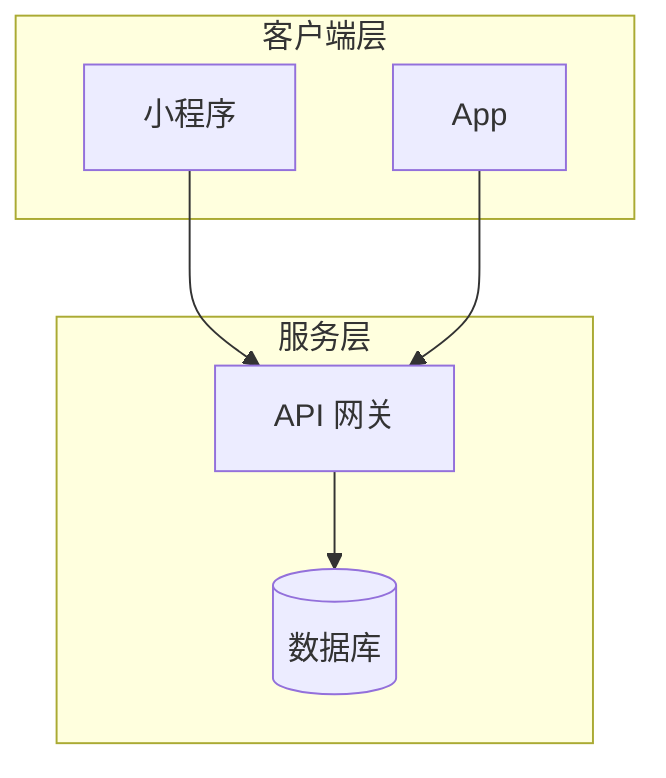
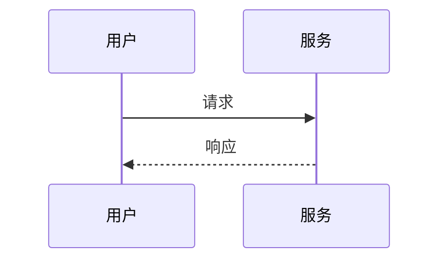

# Mermaid

A flowchart with subgraphs:


```mermaid
flowchart TB
    subgraph A["客户端层"]
        MP["小程序"]
        APP["App"]
    end
    subgraph B["服务层"]
        API["API 网关"]
        DB[("数据库")]
    end
    MP --> API
    APP --> API
    API --> DB
```

And a sequence diagram:


```mermaid
sequenceDiagram
    participant U as 用户
    participant S as 服务
    U->>S: 请求
    S-->>U: 响应
```

A normal code block stays untouched:

```python
print("hello")
```